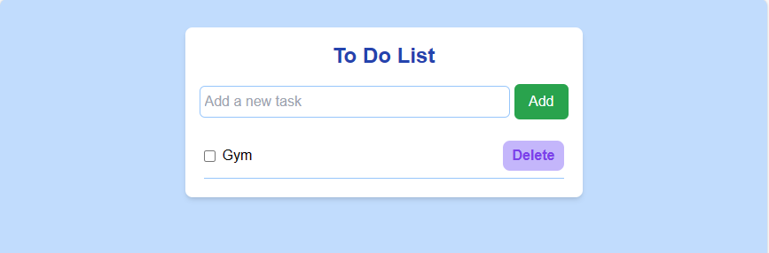
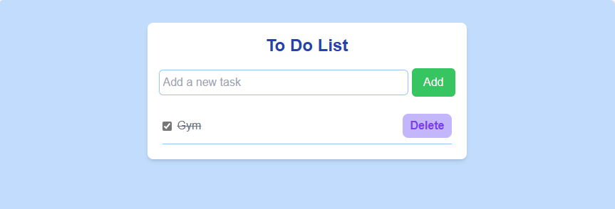

# React + Vite
## About:
- This is based on a course from Orange ODC
## Author: 
- Youssef Abouyahia: [Josh-techie](https://github.com/Josh-techie)

## To Do App

- The To Do App is a simple and intuitive task management application designed to help users organize their daily tasks and activities efficiently. With its clean and user-friendly interface, this app enables users to create, track, and manage their to-do lists effortlessly

### Main Page

### Add Task

### Task Completed:

### Task Deleted:

