# React + Vite
## About:
- This is based on a course from Orange ODC
## Author: 
- Youssef Abouyahia: [Josh-techie](https://github.com/Josh-techie)

## To Do App

- The To Do App is a simple and intuitive task management application designed to help users organize their daily tasks and activities efficiently. With its clean and user-friendly interface, this app enables users to create, track, and manage their to-do lists effortlessly

### Main Page
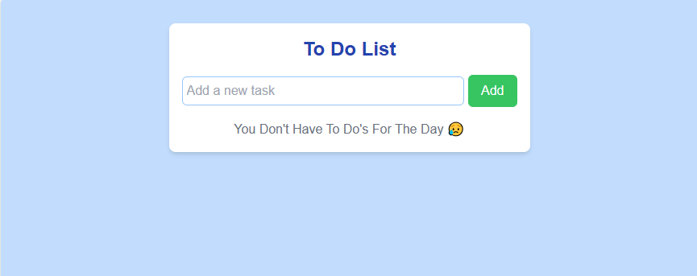

### Add Task

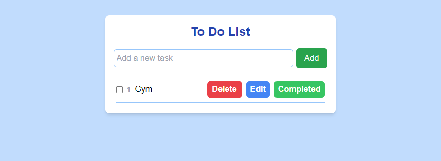
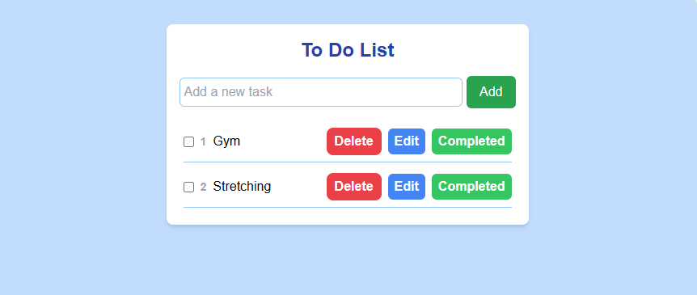

### Task Completed:

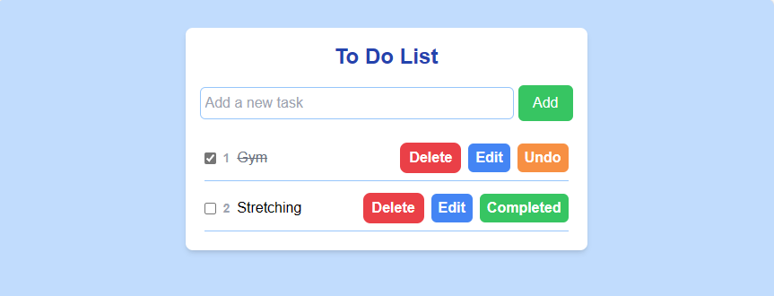

### Task Uncompleted:
- Click Undo, or click on the radio button:
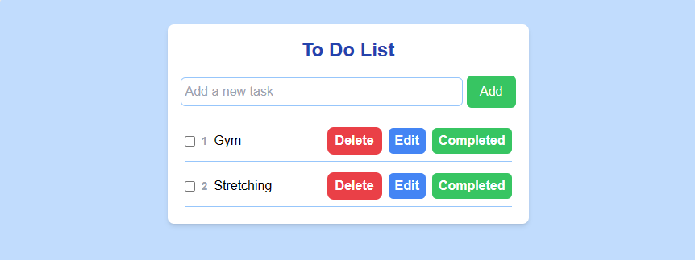

### Task Edited:
- Click on edit, and then:

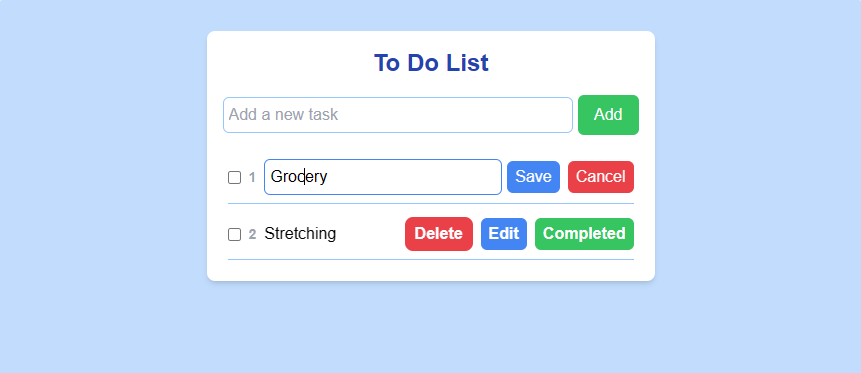

- Then you either save your edit, or cancel:
- Let's save and see:
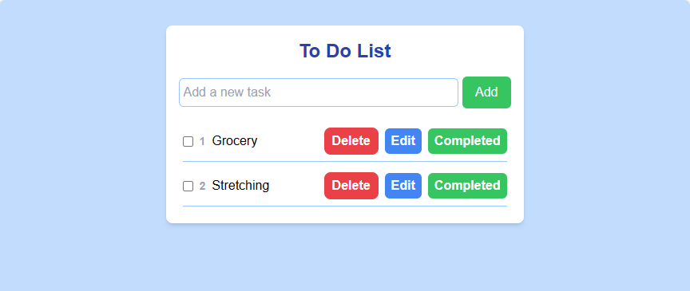

- Let's edit and then cancel:
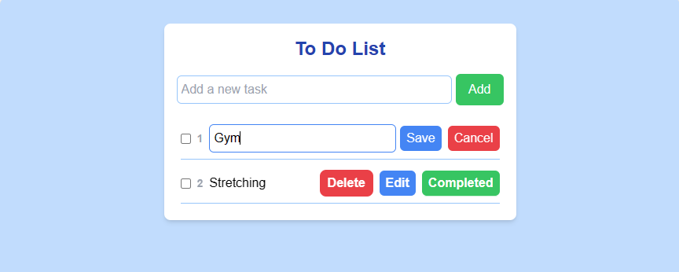

- After cancel:
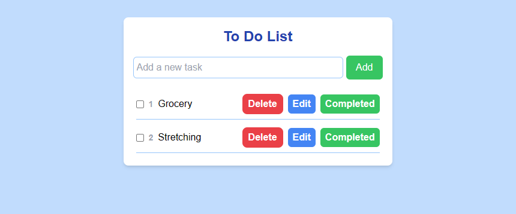

- Still the same old task yaaay 😁
### Task Deleted:

- The order here in 
* 1- Grocery
* 2- Stretching
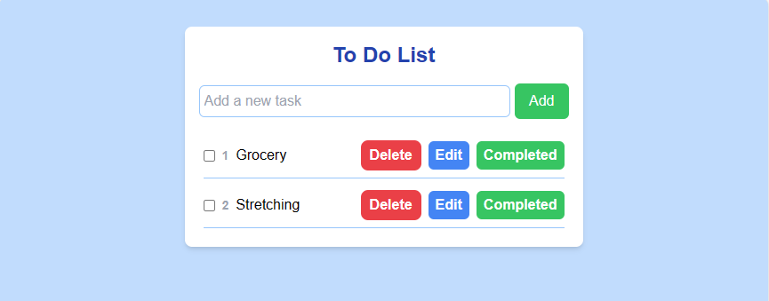

- When Deleted the task 1 * Grocery note you count is self rendered and the now task * Stretching is number 1.

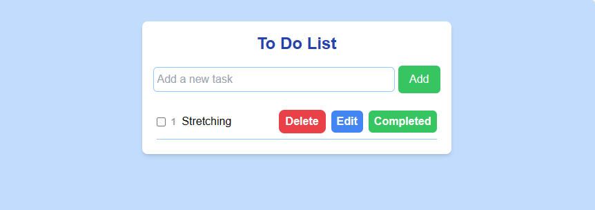

